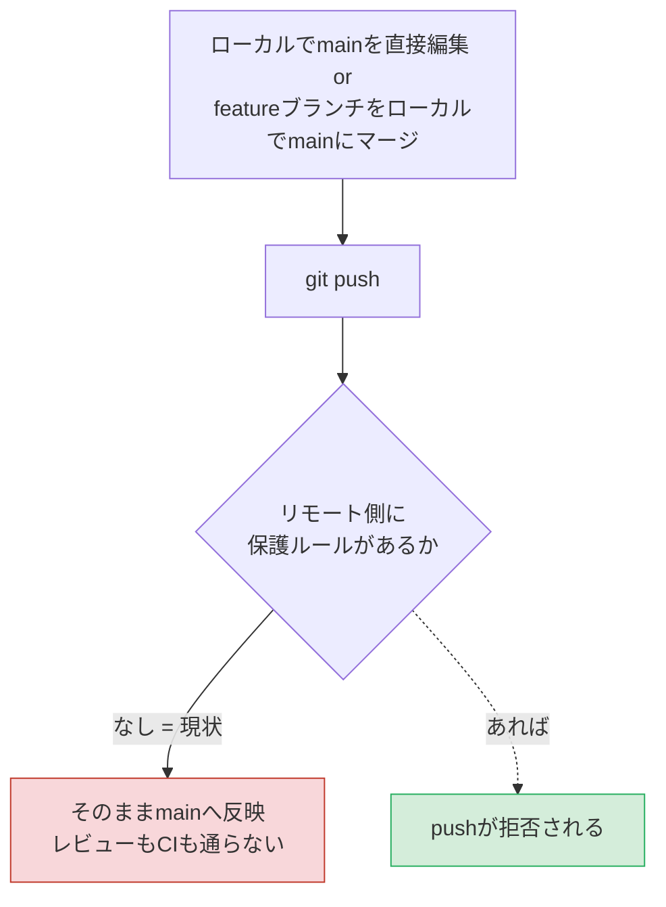
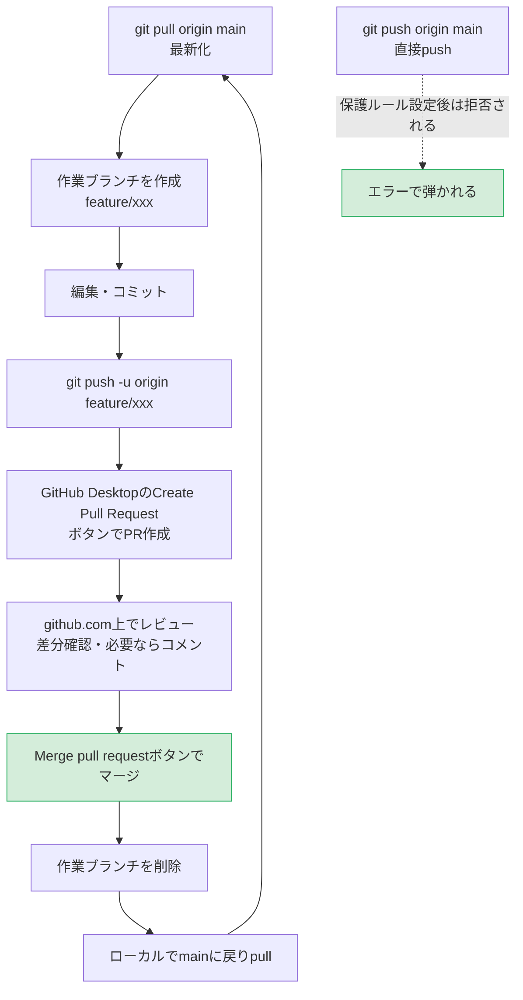

# GitHub Desktopでも「mainへの直接反映」を止める仕組み

## 1. 今なぜPRなしでマージできてしまうのか

`claude_playground` の直近コミット履歴を確認すると、`Merge pull request #2 from ...` という
PR経由のマージは1件のみで、それ以外はすべて `main` ブランチへの直接コミット・直接pushだった。

原因は2つある。

1. **GitHub Desktopの「Merge into current branch」はローカル操作である。**
   ブランチAをブランチB（例：main）に取り込む操作はローカルの`.git`内で完結し、
   GitHub側のPR機構を一切経由しない。その後`git push`すれば、mainは何のチェックも
   受けずにリモートへ反映される。
2. **リモート側（GitHub.com）にbranch protection ruleが設定されていない。**
   PRを強制する唯一の技術的な仕組みは、サーバー側の「mainへの直接pushを拒否する」設定である。
   これが無い限り、Desktopでもコマンドラインでも直接pushが成功してしまう。

つまり「PRを作る/作らない」はこれまで**運用者の意識だけ**に委ねられていた。
`docs/vscode-github-setup.md` にも「mainブランチで直接編集しない」という注意書きはあるが、
これは心がけであってGitHubに強制させる設定ではない。

## 2. 現状のフロー（技術的な歯止めがない）

## 3. あるべきフロー（branch protection + PR必須）

ポイントは、featureブランチの作成〜PR作成〜マージまでの流れ自体は現状の
`docs/vscode-github-setup.md` の「日常の作業フロー」と同じであること。
違いは**mainへのpushをリモート側で技術的に拒否する設定を入れる**点のみである。

## 4. 設定手順（GitHub.com、殿ご自身の操作が必要）

信玄はGitHub CLI（`gh`）が未導入・未認証のためAPI経由での代行ができない。
以下はブラウザから殿ご自身に設定いただく必要がある。

1. `https://github.com/Ponthai-project/claude_playground` を開く
2. **Settings → Branches**（新しいUIでは **Settings → Rules → Rulesets** の場合もある）
3. `main` を対象に保護ルールを新規作成し、最低限以下を有効化する
   - **Require a pull request before merging**（これが直接pushを拒否する本体）
   - **Do not allow bypassing the above settings**（自分が管理者でも例外なく適用させたい場合。個人リポジトリでは任意）
   - Require approvals は0でも構わない（一人運用のため、PRという「一呼吸置く関所」自体が目的）
4. 保存後、試しに `git push origin main` を直接叩いて拒否されることを確認する
   （＝殿ご自身による実機検証を推奨。信玄側では認証情報がなく再現できない）

## 5. GitHub Desktop側の操作対応表

| これまで | 保護ルール設定後 |
|---|---|
| mainのまま編集してCommit to main | 不可（pushが拒否される） |
| ブランチをローカルでmainにMerge into current branch | 不可（push時に拒否される。マージ自体はローカルでは通ってしまう点に注意） |
| ブランチをpush → **Create Pull Request**ボタン | 引き続き可能・これが唯一の正規ルートになる |

Desktop上の「Merge into current branch」操作自体はローカルでは止められない点に注意。
歯止めは常に**push時**にかかる。習慣としては「featureブランチを切ったら、mainへのマージは
必ずCreate Pull Requestボタン経由」に統一するとよい。

## 6. 補足：残存ブランチの整理

調査時点（2026-09-03）でリモートに以下の未整理ブランチが残っていた。

- `claude/ai-dev-videos-summary-b9sgr7` — PR #2で既にmainへマージ済み。削除可能
- `claude/asset-tokenization-blockchain-3bz4b7`
- `claude/claude-md-summary-vni5wu`
- `claude/model-sfity7`

後者3件はマージ済みかどうか未確認。上記のPRフローに揃える機会に、
GitHub上の「Branches」一覧で `Merged` 表示のものから順に削除することを推奨する。
